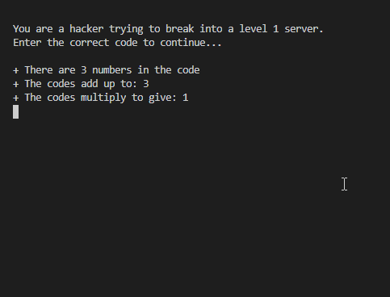

# Break In
You are a hacker trying to break into a corrupt company network and steal confidential files.

But first your must get through their server security.

There are 5 levels.

Each level is made up of 3 codes. 

The codes must add up to the given number.

Also the codes must multiply to equal the given number.

Do you think you can get through?

